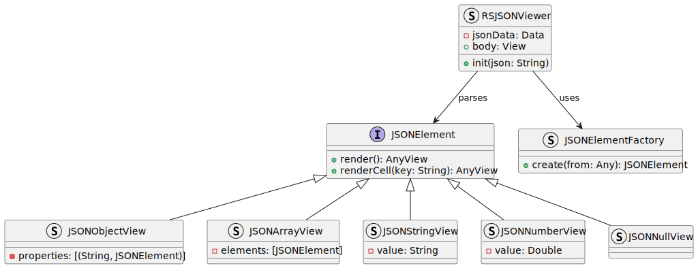

# RSJSONViewer

RSJSONViewer is a Swift package that allows you to view JSON in a navigable and interactive way using SwiftUI. It supports navigation through objects, arrays, strings, numbers, and null values present in a JSON, providing an elegant and easy way to explore the structure of a JSON document.

## Features

- Navigable display of JSON objects using `NavigationView`.
- Support for displaying the following JSON element types:
  - Objects
  - Arrays
  - Strings
  - Numbers
  - Null values (`null`)
- Simple setup using SwiftUI.

## Requirements

- iOS 17.0+ / macOS 11.0+
- Swift 5.3+
- Xcode 12+

## Installation

### Swift Package Manager

You can add RSJSONViewer to your project using [Swift Package Manager (SPM)](https://swift.org/package-manager/).

1. In Xcode, go to `File > Add Packages`.
2. Enter the repository URL:
   ```
   https://github.com/rodrigosoldi/rsjsonviewer.git
   ```
3. Select the version or branch you want to use and add the package to your project.

## How to Use

1. Import the package in your Swift file:
   ```swift
   import RSJSONViewer
   ```

2. Use `RSJSONViewer` in your SwiftUI View to display a JSON:
   ```swift
   struct ContentView: View {
       var body: some View {
           RSJSONViewer(json: """
           {
               "name": "John",
               "age": null,
               "skills": ["Swift", null, "JavaScript"],
               "address": {
                   "city": "New York",
                   "zipcode": "10001"
               }
           }
           """)
       }
   }
   ```

## Customization

The `RSJSONViewer` allows you to explore JSON data and navigate through objects and arrays, displaying the information in a list interface. You can customize and extend the package to add new features, such as support for additional data types or visual styling.

## Project Structure

The RSJSONViewer is composed of the following components:

- `RSJSONViewer`: The main view that takes the JSON string and displays it.
- `JSONElement`: A protocol that defines how each type of JSON element should be rendered.
- `JSONObjectView`: Displays JSON objects as lists of key-value pairs.
- `JSONArrayView`: Displays JSON arrays as lists of elements.
- `JSONStringView`: Displays JSON strings.
- `JSONNumberView`: Displays JSON numbers.
- `JSONNullView`: Displays null (`null`) elements.
- `JSONElementFactory`: A factory that creates instances of JSON elements from native Swift objects.

## UML



## Screenshot

<video width="400" controls>
  <source src="screenshots/screenshot.mp4" type="video/mp4">
  Your browser does not support the video tag.
</video>

## Contributing

Contributions are welcome! Feel free to open issues, suggest improvements, or submit pull requests.

## License

This project is licensed under the [MIT License](LICENSE).

## Contact

If you have any questions, suggestions, or feedback, feel free to reach out via [email](mailto:rodrigo.soldi@gmail.com).